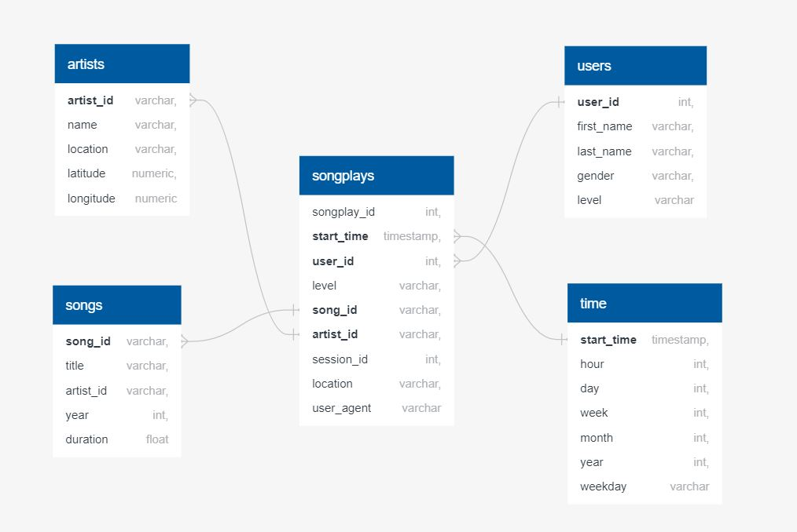

# Project: Data modeling with Postgres

###### by Anna Qin 2021-08-02

## Introduction

A startup called Sparkify wants to analyze the data they've been collecting on songs and user activity on their new music streaming app. 
They'd like a data engineer to create a Postgres database with tables designed to optimize queries on song play analysis.
As a data engineer, I need to create a database schema and ETL pipepline for this analysis.

## Project Description

In this project, I will apply what I've learned on *`data modeling`* with *`Postgres`* and build an *`ETL pipeline`* using *`Python`*. 
I need to define *`fact and demension tables`* for a *`star schema`* for a particular analytic focus, and write an ETL pipeline that 
transfers data from files in two local directories into these tables in Postgres using *`Python`* and *`SQL`*.

## Datasets

### Song Dataset

The first dataset is a subset of real data from the Million Song Dataset. Each file is in JSON format and contains metadata about a song 
and the artist of that song. The files are partitioned by the first three letters of each song's track ID. For example, here are 
filepaths to two files in this dataset. 

*song_data/A/B/C/TRABCEI128F424C983.json*   
*song_data/A/A/B/TRAABJL12903CDCF1A.json*

a single song file, TRAABJL12903CDCF1A.json, looks like 

*{"num_songs": 1, "artist_id": "ARJIE2Y1187B994AB7", "artist_latitude": null, "artist_longitude": null, "artist_location": "", "artist_name": "Line Renaud", "song_id": "SOUPIRU12A6D4FA1E1", "title": "Der Kleine Dompfaff", "duration": 152.92036, "year": 0}*

### Log Dataset
The second dataset consists of log files in JSON format generated by this event simulator based on the songs in the dataset above.   
These simulate activity logs from a music streaming app based on specified configurations.

The log files in the dataset you'll be working with are partitioned by year and month.  
For example, here are filepaths to two files in this dataset.   

*log_data/2018/11/2018-11-12-events.json*  
*log_data/2018/11/2018-11-13-events.json*

an example of what the data in a log file, 2018-11-12-events.json, looks like   

## Star schema for Song Play Analysis

### Fact Table

1. **songplays** - records in log data associated with song plays i.e. records with page *`NextSong`*
                 - songplay_id, start_time, user_id, level, song_id, artist_id, session_id, location, user_agent

### Demension Tables

2. **users** - users in the app
             - user_id, first_name, last_name, gender, level
3. **songs** - songs in music database
             - song_id, title, artist_id, year, duration
4. **artists** - artists in music database
               - artist_id, name, location, latitude, longitude
5. **time** - timestamps of records in songplays broken down into specific units
            - start_time, hour, day, week, month, year, weekday

## Project Files

1. ``test.ipynb`` displays the first few rows of each table to check the created database.
2. ``create_tables.py`` drops and creates my tables. run this file to reset the tables before each time run the ETL scripts.
3. ``etl.ipynb`` reads and processes a single file from song_data and log_data and loads the data into my tables. This notebook contains detailed instructions on the ETL process for each of the tables.
4. ``etl.py`` reads and processes files from song_data and log_data and loads them into my tables. completed it based on etl.ipynb file.
5. ``sql_queries.py`` contains all my sql queries, and is imported into the last three files above.
6. ``README.md`` provides explaination on this project.

## ETL Pipepline

Extract, transform, load (ETL) is the general procedure of copying data from one or more sources into a destination system which represents the data differently from, or in a different context than, the sources.

### Steps to run this pipeline
1. run ``python create_tables.py`` in the terminal, to reset the tables in the database (sparkifydb)
2. run ``test.ipynb`` in the jupyter notebook, to check if the the tables have been successfully created
3. run ``python etl.py`` in the terminal, to process all the datasets (transfer datas from local Json files into tables which created correctly in database)
4. run ``test.ipynb`` in the jupyter notebook, to check if the records inserted into each table without error

